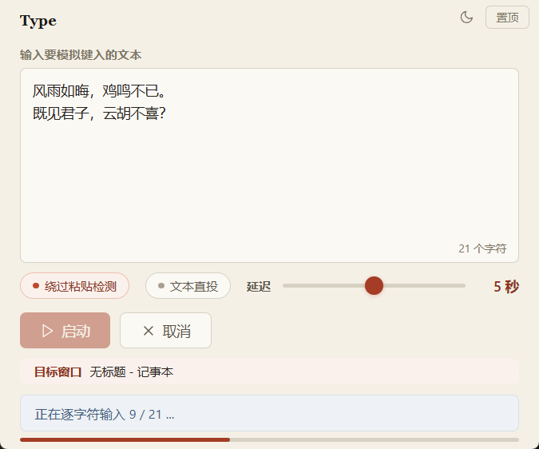

# Type

**键盘模拟输入器**：在文本框中输入内容，倒计时结束后自动模拟键盘键入到任意目标窗口。单文件、零运行时依赖。

[](https://github.com/LeuJasYoh/Type/actions/workflows/ci.yml)
[](https://github.com/LeuJasYoh/Type/releases)
[](https://github.com/LeuJasYoh/Type/releases)
[](LICENSE)


<p align="center">
  <picture>
    <source media="(prefers-color-scheme: dark)" srcset="assets/screenshot-dark.png">
    <source media="(prefers-color-scheme: light)" srcset="assets/screenshot-light.png">
    
  </picture>
</p>

---

## 功能

- **多行文本输入**：支持中文、英文、符号、换行
- **两种输入模式**：
  - **逐字符模拟**：纯英文用 `SendInput` 快速注入，含中文时自动切换为剪贴板
  - **剪贴板粘贴**：用 `Ctrl+V` 粘贴，速度快，自动保存/恢复剪贴板
- **文本直投**（v1.5.0）：面向带代码补全/括号自动配对的在线编辑器，字符（含 Tab）绕过按键层、以文本层消息直接注入，编辑器的补全弹窗劫持（空格被当作"接受候选"）与括号自动配对都不会触发；换行无法走文本层（系统会过滤控制字符），程序会自动先注入 Esc 关闭补全弹窗再按回车
- **目标窗口预览**：倒计时期间跟随当前前台窗口标题（切换窗口立即更新，同一窗口的标题变化每秒刷新一次），执行时锁定并显示实际注入目标
- **焦点漂移防护**（v1.5.3）：键入过程中目标窗口被切走（弹出别的窗口、手动切到别处、切回 Type 自身）时立即停止输入，不把剩余内容打进错误的窗口；终态会说明已输入多少字
- **可调延迟**：1~9 秒倒计时，给你时间聚焦目标窗口
- **启动/取消**：随时中止操作；任务结束后自动复位（无需手动取消）；运行中防重入，不会叠加启动
- **实时状态**：倒计时显示、输入进度、完成提示
- **可靠的剪贴板操作**：占用时自动重试；粘贴前快照、粘贴后恢复**全部剪贴板格式**（文本/图片/文件等），仅在剪贴板未被用户改动时执行恢复，避免覆盖新复制的数据
- **现代化 UI**：WebView2 + Vue 3 渲染

---

## 系统要求

| 组件 | 要求 |
|------|------|
| 操作系统 | Windows 10 / 11（x64 / ARM64） |
| 运行时 | **无** — 单文件，零依赖 |
| WebView2 | Windows 11 预装，Windows 10 需安装 [WebView2 Runtime](https://developer.microsoft.com/microsoft-edge/webview2/) |

---

## 下载

从 [Releases](https://github.com/LeuJasYoh/Type/releases) 下载对应架构的压缩包，解压后双击 `Type.exe` 即可，无需安装：

| 压缩包 | 适用机器 |
|---|---|
| `Type-<版本>-windows-amd64.zip` | 常规 PC（Intel / AMD 处理器） |
| `Type-<版本>-windows-arm64.zip` | Windows on ARM（骁龙等 ARM 处理器） |

拿不准就选 amd64：ARM64 版仅适用于 ARM 处理器的 Windows 设备。

---

## 使用

1. 双击 `Type.exe`
2. 在文本框中输入要模拟键入的内容
3. 勾选“绕过粘贴检测”可强制逐字符输入（默认含中文自动走剪贴板）
4. 往带代码补全/括号配对的编辑器（在线编程作业等）键入时，勾选“文本直投”
5. 调节倒计时秒数
6. 点击 **启动**
7. 在倒计时结束前将鼠标焦点切换到目标窗口（如记事本、浏览器、聊天框等）
8. 程序自动完成输入（输入期间请保持该窗口在前台：一旦切走，输入会立即停止）

---

## 已知限制

- **目标窗口权限**：受 Windows UIPI 限制，以普通权限运行的 Type 无法向管理员权限的窗口（如管理员 CMD/PowerShell）注入输入，此时 `SendInput` 不产生任何按键。程序检查注入结果并按路径给出具体原因（逐字符路径报"输入中断：目标窗口拒绝了模拟按键…"；剪贴板路径区分"剪贴板操作失败"与"粘贴未生效：目标窗口拒绝了模拟按键…"），不会把静默失败报成"输入完成"。如需面向提权窗口，请以管理员身份运行 Type.exe。
- **剪贴板特殊格式**：延迟渲染（delayed rendering）及句柄型格式（CF_BITMAP 等）无法同步快照，粘贴模式结束时会丢失；常见场景（截图工具、浏览器复制图片、资源管理器复制文件）均在快照恢复范围内。
- **为什么含中文会自动改用剪贴板**：`SendInput` + `KEYEVENTF_UNICODE` 对全角标点（U+FF00~FFEF）存在系统级处理异常，表现为标点重复、后续字符被吞。程序检测到文本含中文时自动降级为剪贴板 `Ctrl+V`，输入才准确无误。
- **杀毒软件误报**：键盘模拟（SendInput）与剪贴板操作是杀软启发式扫描的常见敏感组合，若下载或运行时被误报，请添加信任或自行编译。
- **单实例**：同时只允许运行一个实例（第二个实例会提示并退出），避免两个实例争抢剪贴板与键盘焦点。
- **焦点仍在 Type 自身时不输入**：倒计时结束时若焦点仍停留在 Type 窗口（未切换到目标窗口），程序会明确报错并放弃输入，不会把内容打进自己的输入框。
- **键入中途切换目标窗口会立即停止**：逐字符输入时每个字符注入前都确认目标窗口仍是倒计时结束时锁定的那一个，一旦切走（含切回 Type 自身）就停下，终态说明已输入多少字；剪贴板路径在写入剪贴板前、粘贴前各确认一次，粘贴瞬间发生切换则报“粘贴结果无法确认”。检查与注入之间还有毫秒级间隙，切换恰好发生在其中时最多漏进一两个字。
- **上面那条的判定只到“窗口”这一层**：判据是顶层窗口标识而不是标题，目标程序自己弹出的模态窗口（如“另存为”）会改变顶层窗口，因而会中止；但窗口**内部**的目标变化看不到，输入会继续落到新的位置。具体包括：在网页或编辑器里点到另一个输入框、浏览器切换标签页（标签页不是窗口，多个标签页共用同一个内容窗口，切换时窗口层面完全不变）、输入法候选窗与补全弹窗（这些本来就不该中止）。要看住这一层需改用系统辅助功能接口逐元素比对，代价与稳定性风险都高，故未做。
- **多显示器与缩放**：界面按显示器缩放渲染（已声明 PerMonitorV2 DPI 感知，缩放非 100% 时文字清晰不虚），窗口尺寸在启动时按所在显示器的缩放换算；把窗口拖到**缩放比例不同**的另一台显示器上不会重新适配（重启即可恢复）。单显示器无感。
- **文本直投的边界**：该开关只作用于逐字符路径，**含中文（非 ASCII）的文本默认仍走剪贴板粘贴**，不受它影响；要让中文也走文本层，需同时勾选"绕过粘贴检测"（此时全角标点不再需要 WM_CHAR 绕行，直接经文本层注入）。补全弹窗无法从外部探测，回车前会无条件注入 `Esc`（弹窗开着则被关闭，没开则基本无操作）；目标处于浏览器全屏（Esc 会退出全屏）或 Vim 等 Esc 是功能键的场景请勿开启。个别不处理文本消息的目标（如部分游戏）不适用，关掉即可。

---

## 开发

### 技术栈

| 项 | 内容 |
|---|---|
| 语言 | Go 1.26 |
| GUI | WebView2（Edge Chromium） |
| 前端 | Vue 3 + TypeScript，Vite 构建为单文件 HTML（无其他运行时依赖） |
| 构建 | vue-tsc 类型检查 + Vite（vite-plugin-singlefile）+ `go run ./tools/mkres` + `go build` |
| CI | GitHub Actions（windows-latest）：gofmt / go vet / go test / go build + 前端产物漂移检查 + 版本同步检查；另按 amd64/arm64 矩阵做发布构建，并用 `tools/pecheck` 读回校验图标、版本与 DPI 声明确实已链入产物 |
| 发布 | 打 `v<版本>` 标签即由 GitHub Actions 自动发行：校验版本与发布说明一致 → 双架构构建 + 读回校验 → 打包 → 建 Release；说明文字取自入库的 `release-notes/v<版本>.md` |
| Win32 API | SendInput（KEYEVENTF_UNICODE）+ WM_CHAR 文本直投（SendMessageTimeoutW 直投焦点窗口）+ 剪贴板（CF_UNICODETEXT、EnumClipboardFormats 全格式快照、RtlMoveMemory）+ 前台窗口检测（GetForegroundWindow）+ 单实例互斥体（CreateMutexW） |
| 图标 | 圆角多尺寸 ICO（uv + Pillow 生成，`scripts/gen_icon.py` 字节级可复现） |
| 资源 | `tools/mkres`（纯 Go，winres）生成图标 + 版本信息 + manifest（DPI 感知）→ `.syso` |

### 项目结构

```
Type/
├── Type.exe                 ← 可执行文件 (构建产物, 输出于根目录, 不入库)
├── cmd/type/                ← Go 入口包
│   ├── main.go              ← webview 装配与 Bind 绑定
│   ├── typing.go            ← 业务层: TypingService 输入状态机 + 平台能力接口
│   ├── win32.go             ← Win32 清单页: DLL 与 API 入口集中声明
│   ├── win32_keyboard.go    ← 键盘注入 (SendInput / WM_CHAR 全角标点绕行)
│   ├── win32_clipboard.go   ← 剪贴板全格式快照/恢复
│   ├── win32_window.go      ← 置顶 / 图标 / 前台窗口探测
│   ├── win32_instance.go    ← 单实例守卫 (具名互斥体)
│   ├── devserver_prod.go    ← 正式构建: 恒加载嵌入页面
│   ├── devserver_dev.go     ← dev 构建 (`-tags dev`): 指向 Vite dev server
│   ├── main_test.go         ← 单元测试 (UTF-16 拆分/ASCII/CJK 标点/剪贴板快照与守卫/窗口标题与类图标索引)
│   └── typing_test.go       ← 状态机单元测试 (fake 注入器/剪贴板/前台窗口, 不触真实系统)
├── internal/web/            ← go:embed 前端产物包
│   ├── web.go               ← IndexHTML 嵌入声明 (供 cmd/type 经 SetHtml 加载)
│   └── dist/index.html      ← Vite 构建产物: 自包含单文件 (入库)
├── frontend/                ← Vue 前端 (自包含 Vite 项目)
│   ├── package.json / package-lock.json ← npm 定义 (vue / vite / vue-tsc 等)
│   ├── vite.config.ts       ← Vite 配置 (单文件打包, 产物输出 ../internal/web/dist)
│   ├── index.html           ← Vite 入口
│   ├── tsconfig.json        ← TypeScript 配置 (vue-tsc)
│   └── src/
│       ├── main.ts          ← 应用入口 (createApp)
│       ├── App.vue          ← 界面骨架
│       ├── style.css        ← 界面样式（书卷纸感设计系统：纸色底、墨色字、朱砂强调，明暗双主题）
│       ├── ipc.ts           ← webview Bind 全局绑定的类型化封装
│       ├── types.ts         ← TypingStatus/TypingPhase (与 Go 端结构对应)
│       ├── env.d.ts         ← Vite 环境类型声明
│       ├── composables/
│       │   ├── useTypingTask.ts ← 输入任务状态机 + 状态轮询
│       │   └── useTheme.ts      ← 明暗主题切换
│       └── components/
│           └── StatusBar.vue    ← 状态栏 + 进度条
├── assets/                  ← 静态资源（图标源图与产物、README 配图）
│   ├── icon.ico             ← 应用图标 (tools/mkres 编译进 exe)
│   ├── icon.jpg             ← 图标源图
│   ├── screenshot-light.png ← README 配图（浅色，兜底图）
│   └── screenshot-dark.png  ← README 配图（深色，随 GitHub 主题自动切换）
├── scripts/
│   ├── build.ps1            ← 一键构建脚本（版本号单一来源）
│   └── gen_icon.py          ← 图标资产生成 (uv run, Pillow)
├── tools/
│   ├── equivcheck/          ← 重构等价性验证 (go run ./tools/equivcheck, 逐函数比对函数体)
│   ├── mkres/               ← 资源生成: 图标 + 版本信息 + DPI 感知 manifest → version_<arch>.syso
│   ├── pecheck/             ← 构建产物读回校验: PE 架构 + 图标/版本/manifest 是否真的链进 exe (发版与 CI 共用)
│   └── wmcharprobe/         ← 注入通道探针 (WM_CHAR 文本直投 vs SendInput 按键, 用法见文件头注释)
├── testdata/                ← 手工测试页 (paste-guard.html 防粘贴 / completion-guard.html 补全+配对, 用法见页内注释)
├── release-notes/           ← 各版本发布说明 (v<版本>.md, 发布时原样作为 Release 正文)
├── .github/workflows/
│   ├── ci.yml               ← CI: gofmt / vet / test / build + 前端产物漂移检查 + 版本同步检查 + 双架构发布构建与资源读回
│   └── release.yml          ← 发版: 打 v<版本> 标签触发, 构建/校验/打包/建 Release (也可在 Actions 页面手动触发)
├── go.mod / go.sum          ← Go 模块定义
├── pyproject.toml / uv.lock / .python-version ← Python 资产管线依赖 (uv 管理, 锁定 Pillow)
└── .gitignore               ← 忽略构建产物/依赖/工具元数据
```

### 自行编译

```powershell
# 前置条件
#   - Go 1.26+ (与 go.mod 声明一致; 不需要 C 工具链)
#   - Node.js 20+ (前端构建期需要, 产物无需)
#   - WebView2 库（go mod tidy 自动下载）

cd Type
go mod tidy

# 一键构建 (推荐): 版本号同步 → Vue 前端构建 → 资源生成 → go build
# (末尾自动读回产物, 校验图标/版本/DPI 声明确实已链入)
powershell -ExecutionPolicy Bypass -File .\scripts\build.ps1

# 或手动分步:
cd frontend
npm install                         # 安装前端依赖 (仅首次)
npm run build                       # vue-tsc 类型检查 + Vite → ../internal/web/dist/index.html
cd ..
go run ./tools/mkres -version 1.5.3 -icon assets/icon.ico -out cmd/type/version
go build -ldflags="-H windowsgui -s -w" -o Type.exe ./cmd/type

# 读回校验: 图标/版本信息/DPI 声明是否真的链进了产物(.syso 缺失时
# go build 不会失败, 产物只是悄悄少了这些)
go run ./tools/pecheck -exe Type.exe -version 1.5.3 -arch amd64

# 交叉编译 ARM64 版 (纯 Go, 不需要额外工具链; 资源上一步已按架构生成)
$env:GOARCH = "arm64"; go build -ldflags="-H windowsgui -s -w" -o Type-arm64.exe ./cmd/type

# 图标资产再生成 (可选, 需 uv): 更换 assets/icon.jpg 后执行, 产物字节级可复现
uv run scripts/gen_icon.py

# 代码校验 (与 CI 同款三件套)
gofmt -l ./cmd ./internal ./tools   # 应输出为空
go vet ./...
go test -count=1 ./...
```

### 前端开发模式 (HMR)

开发模式需**带 `dev` 构建标签编译**: 指向 dev server 的代码整体编译在该标签之后,
正式发布的 exe 不含这段代码（环境变量无法把界面引向任意外部地址）。

```powershell
cd frontend
npm run dev                 # 终端 1: Vite dev server (http://localhost:5173)
cd ..
go build -tags dev -o Type-dev.exe ./cmd/type   # 终端 2: 带 dev 标签构建
.\Type-dev.exe              # 改代码即时热更新
```

带标签构建时，`-dev` 参数或 `TYPE_DEV_URL` 环境变量指定 dev server 地址；
若 5173 端口被占用，用 `TYPE_DEV_URL` 指向实际地址（如 `http://localhost:5174`）。
不带标签构建的 exe 恒加载嵌入页面，两个开关均不生效。

### 手工测试页

`testdata/paste-guard.html` 用浏览器打开即可：三档递增的防粘贴页面（只拦 paste 事件 / 追加拦 Ctrl+V、右键、拖放 / 再叠加输入节奏分析），用来验证 Type 各模式在禁粘贴页面的真实表现，页内表格列出预期结果。用法详见文件头部注释。

`testdata/completion-guard.html` 复刻"禁粘贴 + 关键词候选补全 + 括号自动配对"的在线编程编辑器：弹窗开着时回车/空格/Tab 是否"接受候选"、是否自动配对由页内开关决定，`Esc` 关闭弹窗；内置逐键事件日志与预期文本对比，用于验证"文本直投"的效果。页面 title 携带统计摘要（字符数/键盘事件/无键输入/自动配对/接受候选），配合 `tools/wmcharprobe` 可自动化验证注入通道（详见该工具头部注释）。

---

## 反馈

使用中遇到问题或有改进建议，欢迎在 [Issues](https://github.com/LeuJasYoh/Type/issues) 提出。

---

## 作者

**LeuJasYoh**

---

## 许可

本项目基于 [MIT License](LICENSE) 开源发布。

发布产物内含第三方组件（go-webview2、go-winloader、golang.org/x/sys 与内嵌的 WebView2Loader.dll），
版权与许可全文见 [THIRD_PARTY_NOTICES.md](THIRD_PARTY_NOTICES.md)。
