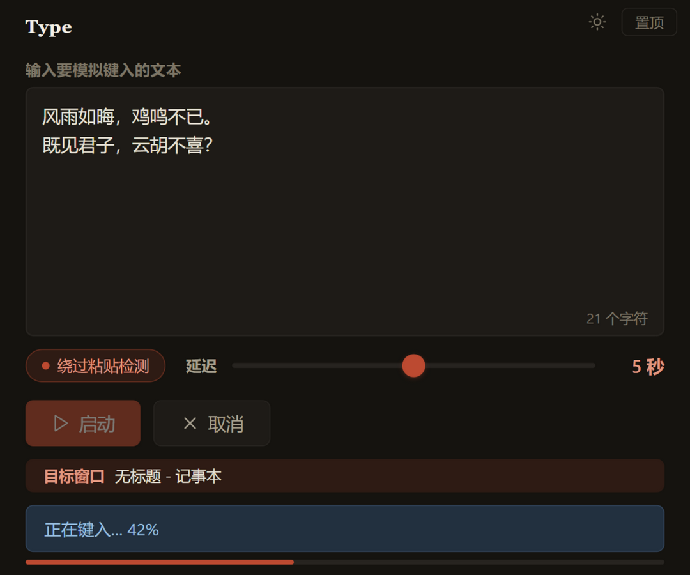

# Type

**键盘模拟输入器** —— 在文本框中输入内容，5 秒后自动模拟键盘键入到任意目标窗口。



---

## 功能

- **多行文本输入** —— 支持中文、英文、符号、换行
- **两种输入模式**：
  - **逐字符模拟** —— 纯英文用 `SendInput` 快速注入，含中文时自动切换为剪贴板
  - **剪贴板粘贴** —— 用 `Ctrl+V` 粘贴，速度快，自动保存/恢复剪贴板
- **目标窗口预览** —— 倒计时期间实时显示当前前台窗口标题，确认焦点已切对
- **可调延迟** —— 1~9 秒倒计时，给你时间聚焦目标窗口
- **启动/取消** —— 随时中止操作；运行中防重入，不会叠加启动
- **实时状态** —— 倒计时显示、输入进度、完成提示
- **可靠的剪贴板操作** —— 占用时自动重试；粘贴前快照、粘贴后恢复**全部剪贴板格式**（文本/图片/文件等），仅在剪贴板未被用户改动时执行恢复，避免覆盖新复制的数据
- **现代化 UI** —— WebView2 + Vue 3 渲染

---

## 使用

1. 双击 `Type.exe`
2. 在文本框中输入要模拟键入的内容
3. 勾选“绕过粘贴检测”可强制逐字符输入（默认含中文自动走剪贴板）
4. 调节倒计时秒数
5. 点击 **启动**
6. 在倒计时结束前将鼠标焦点切换到目标窗口（如记事本、浏览器、聊天框等）
7. 程序自动完成输入

---

## 系统要求

| 组件 | 要求 |
|------|------|
| 操作系统 | Windows 10 / 11（x64） |
| 运行时 | **无** — 单文件，零依赖 |
| WebView2 | Windows 11 预装，Windows 10 需安装 [WebView2 Runtime](https://developer.microsoft.com/microsoft-edge/webview2/) |

---

## 技术栈

```
语言      Go 1.26
GUI       WebView2 (Edge Chromium)
前端      Vue 3 + TypeScript, Vite 构建为单文件 HTML (无其他运行时依赖)
构建      vue-tsc 类型检查 + Vite (vite-plugin-singlefile) + windres + go build
Win32 API SendInput (KEYEVENTF_UNICODE) + 剪贴板 (CF_UNICODETEXT, EnumClipboardFormats 全格式快照, RtlMoveMemory) + 前台窗口检测 (GetForegroundWindow)
图标      圆角多尺寸 ICO（uv + Pillow 生成, scripts/gen_icon.py 字节级可复现）
资源      windres 编译 .rc → .syso
```

### 项目结构

```
Type/
├── Type.exe                 ← 可执行文件 (构建产物, 输出于根目录, 不入库)
├── cmd/type/                ← Go 入口包
│   ├── main.go              ← webview 装配与 Bind 绑定
│   ├── typing.go            ← 业务层: TypingService 输入状态机 + 平台能力接口
│   ├── win32.go             ← Win32 清单页: DLL 与 API 入口集中声明
│   ├── win32_keyboard.go    ← 键盘注入 (SendInput / WM_CHAR 全角标点绕行)
│   ├── win32_clipboard.go   ← 剪贴板全格式快照/恢复
│   ├── win32_window.go      ← 置顶 / 图标 / 前台窗口探测
│   ├── main_test.go         ← 单元测试 (UTF-16 拆分/ASCII/CJK 标点/剪贴板快照)
│   └── typing_test.go       ← 状态机单元测试 (fake 注入器/剪贴板, 不触真实系统)
├── internal/web/            ← go:embed 前端产物包
│   └── dist/index.html      ← Vite 构建产物: 自包含单文件 (入库)
├── frontend/                ← Vue 前端 (自包含 Vite 项目)
│   ├── package.json / package-lock.json ← npm 定义 (vue / vite / vue-tsc 等)
│   ├── vite.config.ts       ← Vite 配置 (单文件打包, 产物输出 ../internal/web/dist)
│   ├── index.html           ← Vite 入口
│   ├── tsconfig.json        ← TypeScript 配置 (vue-tsc)
│   └── src/
│       ├── main.ts          ← 应用入口 (createApp)
│       ├── App.vue          ← 界面骨架
│       ├── style.css        ← 界面样式（书卷纸感设计系统：纸色底、墨色字、朱砂强调，明暗双主题）
│       ├── ipc.ts           ← webview Bind 全局绑定的类型化封装
│       ├── types.ts         ← TypingStatus/TypingPhase (与 Go 端结构对应)
│       ├── env.d.ts         ← Vite 环境类型声明
│       ├── composables/
│       │   ├── useTypingTask.ts ← 输入任务状态机 + 状态轮询
│       │   └── useTheme.ts      ← 明暗主题切换
│       └── components/
│           └── StatusBar.vue    ← 状态栏 + 进度条
├── assets/                  ← 静态资源与 Windows 资源定义
│   ├── icon.ico             ← 应用图标 (version.rc 引用, windres 编译进 exe)
│   ├── icon.jpg             ← 图标源图
│   ├── screenshot.png       ← README 截图
│   ├── version.rc           ← 版本/作者信息资源 (windres 编译为 cmd/type/version.syso)
│   └── winres/              ← winres 格式资源定义 (winres.json + 多尺寸 PNG)
├── scripts/
│   ├── build.ps1            ← 一键构建脚本（版本号单一来源）
│   └── gen_icon.py          ← 图标资产生成 (uv run, Pillow)
├── tools/
│   └── equivcheck/          ← 重构等价性验证 (go run ./tools/equivcheck, 逐函数比对函数体)
├── testdata/                ← 手工测试页 (paste-guard.html)
├── go.mod / go.sum          ← Go 模块定义
├── pyproject.toml / uv.lock ← Python 资产管线依赖 (uv 管理, 锁定 Pillow)
└── .gitignore               ← 忽略构建产物/依赖/工具元数据
```

---

## 自行编译

```powershell
# 前置条件
#   - Go 1.26+ (与 go.mod 声明一致)
#   - MinGW-w64 (gcc, windres)
#   - Node.js 20+ (前端构建期需要, 产物无需)
#   - WebView2 库（go mod tidy 自动下载）

cd Type
go mod tidy

# 一键构建 (推荐): 版本号同步 → Vue 前端构建 → windres → go build
powershell -ExecutionPolicy Bypass -File .\scripts\build.ps1

# 或手动分步:
cd frontend
npm install                         # 安装前端依赖 (仅首次)
npm run build                       # vue-tsc 类型检查 + Vite → ../internal/web/dist/index.html
cd ..
windres -I assets -o cmd/type/version.syso assets/version.rc
go build -ldflags="-H windowsgui -s -w" -o Type.exe ./cmd/type

# 图标资产再生成 (可选, 需 uv): 更换 assets/icon.jpg 后执行, 产物字节级可复现
uv run scripts/gen_icon.py
```

---

## 前端开发模式 (HMR)

```powershell
cd frontend
npm run dev                 # 终端 1: Vite dev server (http://localhost:5173)
cd ..
.\Type.exe -dev             # 终端 2: 窗口指向 dev server, 改代码即时热更新
```

`-dev` 模式下 webview 的 Go 绑定照常工作，可完整调试 IPC 链路。若 5173 端口被占用，设置 `TYPE_DEV_URL` 环境变量指定实际地址（如 `http://localhost:5174`）。

---

## 输入错误说明

`SendInput` + `KEYEVENTF_UNICODE` 对全角标点（U+FF00~FFEF）存在系统级处理异常，表现为标点重复、后续字符被吞。**解决方案**：程序检测到文本含中文时，自动降级为剪贴板 `Ctrl+V` 模式，保证输入准确无误。

---

## 已知限制

- **目标窗口权限** —— Windows UIPI 限制：以普通权限运行的 Type 无法向管理员权限的窗口（如管理员 CMD/PowerShell）注入输入，表现为静默无效。如需面向提权窗口，请以管理员身份运行 Type.exe。
- **剪贴板特殊格式** —— 延迟渲染（delayed rendering）及句柄型格式（CF_BITMAP 等）无法同步快照，粘贴模式结束时会丢失；常见场景（截图工具、浏览器复制图片、资源管理器复制文件）均在快照恢复范围内。
- **杀毒软件误报** —— 键盘模拟（SendInput）与剪贴板操作是杀软启发式扫描的常见敏感组合，若下载或运行时被误报，请添加信任或自行编译。

---

## 作者

**LeuJasYoh**

---

## 许可

本项目基于 [MIT License](LICENSE) 开源发布。

